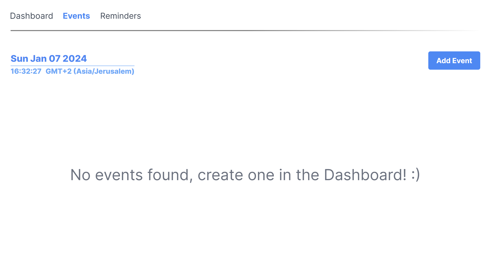

# Event-Driven Scheduler

This project aims to create a scalable, event-driven architecture for scheduling events in a calendar. The architecture is composed of multiple independent microservices, each capable of functioning autonomously and delivering its specific features.

The primary motivation behind this project is to gain practical experience with various tools and establish effective workflows for a larger, upcoming project. Much of the code developed here is reusable and will be incorporated into the larger project.

Each microservice in this project is containerized using its own Dockerfile. The `scheduler-shared` repository, a subtree of this project, is utilized as a compiled TypeScript npm package. Its classes and configurations are employed throughout the entire project.

These classes are designed as singletons, intended to be instantiated only once per service.

# Event Flow charts
These graphs present an example of how the architecture works when you create an event. The flow is similiar to when you delete a reminder and so on.
# 
# 

### The project is a monorepo while the scheduler-shared is also a subtree


The technology stack of this project includes noteworthy packages such as:


### Frontend:

- `NextJS` for the React framework
- `TailwindCSS` for utility-first CSS
# 
# 
# 
# 


### Backend:
- `Node.js` as the runtime environment
- `TypeScript` for static typing
- `Express` as the web application framework
- `Axios` for promise-based HTTP requests
- `MongoDB` as the NoSQL database
- `Redis` for in-memory data storage
- `RabbitMQ` for message queuing
- `BullQueue` for job and message queueing
- `Docker` for containerization
- `dotenv` for environment variable management


# Project Structure

```
├── README.md
├── scheduler-api
│   ├── Dockerfile
│   ├── README.md
│   ├── package.json
│   ├── src
│   │   ├── __tests__
│   │   │   ├── events-controller.test.ts
│   │   │   └── mock.ts
│   │   ├── app.config.ts
│   │   ├── app.ts
│   │   ├── routes
│   │   │   ├── events.ts
│   │   │   └── reminders.ts
│   │   ├── services
│   │   │   ├── external-services.ts
│   │   │   └── gateway.service.ts
│   │   └── utils
│   │       └── middleware.ts
│   └── tsconfig.json
├── scheduler-client
│   ├── Dockerfile
│   ├── src
│   │   ├── app
│   │   │   ├── (pages)
│   │   │   │   ├── dashboard
│   │   │   │   │   ├── components
│   │   │   │   │   │   └── AddEventForm
│   │   │   │   │   │       ├── EventForm.tsx
│   │   │   │   │   │       ├── components
│   │   │   │   │   │       │   ├── EventFormInput.tsx
│   │   │   │   │   │       │   └── EventFormSelect.tsx
│   │   │   │   │   │       └── consts.tsx
│   │   │   │   │   └── page.tsx
│   │   │   │   ├── events
│   │   │   │   │   ├── components
│   │   │   │   │   │   ├── AddEventDialog.tsx
│   │   │   │   │   │   └── Clock.tsx
│   │   │   │   │   └── page.tsx
│   │   │   │   └── reminders
│   │   │   │       └── page.tsx
│   │   │   ├── global-components
│   │   │   │   ├── buttons
│   │   │   │   │   ├── IconButton.tsx
│   │   │   │   │   ├── WideButton.tsx
│   │   │   │   │   └── svgs
│   │   │   │   │       └── SvgIcons.tsx
│   │   │   │   └── navbar
│   │   │   │       ├── Navbar.module.css
│   │   │   │       └── Navbar.tsx
│   │   │   ├── globals.css
│   │   │   ├── layout.tsx
│   │   │   └── page.tsx
│   │   ├── models
│   │   │   ├── event.ts
│   │   │   └── reminder.ts
│   │   └── services
│   │       ├── eventsService.ts
│   │       ├── external-services.ts
│   │       └── remindersService.ts
├── scheduler-events
│   ├── Dockerfile
│   ├── src
│   │   ├── app.config.ts
│   │   ├── app.ts
│   │   ├── controllers
│   │   │   └── events-controller.ts
│   │   ├── routes
│   │   │   └── events
│   │   │       ├── events.ts
│   │   │       ├── events.utils.ts
│   │   │       └── events.validator.ts
│   │   └── services
│   │       ├── events.service.ts
│   │       └── external-services.ts
├── scheduler-logger
│   ├── Dockerfile
│   ├── src
│   │   └── app.ts
├── scheduler-reminders
│   ├── Dockerfile
│   ├── src
│   │   ├── app.ts
│   │   ├── controllers
│   │   │   └── reminders.controller.ts
│   │   ├── routes
│   │   │   └── reminders.ts
│   │   └── services
│   │       ├── external-services.ts
│   │       └── reminders.service.ts
│   └── tsconfig.json
└── scheduler-shared
    ├── Dockerfile
    ├── configs
    │   └── defaults.ts
    ├── index.ts
    ├── models
    │   ├── BullQ.models.ts
    │   ├── Event.models.ts
    │   ├── Reminder.models.ts
    │   └── Task.ts
    ├── package.json
    ├── services
    │   ├── BullQService.ts
    │   ├── MongoDB.ts
    │   ├── RESTClient.ts
    │   └── RabbitMQ
    │       ├── RMQService.ts
    │       └── consts.ts
    └── utils
        ├── APIutils.ts
        ├── helpers.ts
        └── initiators.ts
```

# Overview
The flow of the project is as follows:
This project is designed to function in the following manner:

- Users have the ability to schedule events using a form on the client web page.
- The details of the scheduled event from the form are transmitted to the API Gateway (GW) via a REST request.
- The API GW then routes the REST request to the `scheduler-events` service, while simultaneously logging the request using RabbitMQ.
- The `scheduler-events` service, upon receipt of the request, stores the event in MongoDB and broadcasts a message to a RabbitMQ topic.
- The `scheduler-reminders` service intercepts the message from the `scheduler-events` service and sets up a reminder for the event as an asynchronous job in the Bull Queue.
- After the reminder is set, the `scheduler-events` service broadcasts another message to a RabbitMQ topic to indicate the creation of a reminder.
- The `scheduler-events` service intercepts this message and updates the corresponding event in MongoDB.

In the event of an event deletion, all associated reminders (currently, only one can be added via the client) are also removed. If a reminder is deleted, its reference is eliminated from the event's record in MongoDB. All these operations are executed using RabbitMQ for inter-service communication, ensuring a swift process.

Although these operations could be executed using REST, the architecture in this project is designed differently, showcasing that both approaches are viable.

## scheduler-gateway

This is a simple API GW that is used to route API requests to the entire app.
It sends REST requests out to other microservices and is used by an intermidiery by the client
or the user.

### Events

- `GET /events`: Retrieves all events.
    ```
    URL: http://localhost:3000/api/events
    Method: GET
    ```

- `POST /events`: Creates a new event.
    ```js
    URL: http://localhost:3000/api/events
    Method: POST
    Headers: Content-Type: application/json
    Body: 
    {
        "title": "Annual Company Retreat",
        "description": "A two-day retreat focusing on team building and strategic planning",
        "location": "Mountainview Resort",
        "venue": "Grand Hall",
        "eventSchedule": "2024-06-20T09:00:00.000Z",
        "participants": 150,
        "createdAt": "2024-01-07T10:00:00.000Z"
    }

- `GET /events/:eventId`
  ```js
  URL: http://localhost:8000/api/events/:eventId
  METHOD: GET
  Headers: Content-Type: application/json
  ```
### Reminders
- `GET /reminders`: Retrieves all reminders.
    ```js
    URL: http://localhost:8000/api/reminders
    Method: GET
    ```

- `DELETE /reminders`: Creates a new reminder.
    ```JS
    URL: http://localhost:8000/api/reminders/:jobId
    Method: DELETE
    Headers: Content-Type: application/json
    ```


### Other services also support limited REST API requests such as GET and DELETE. Each service may be approached via REST Directly using ```http://localhost:${SERVICE_PORT}/${scheduler-prefix}``` url. 


## Repository Structure

This repository is organized into several directories, each representing a different microservice:

- `scheduler-client/`: This directory contains the client-side application. It includes configuration files for Next.js and Tailwind CSS, as well as the application's source code in the `src/` directory.

- `scheduler-events/`: This directory contains the events microservice. It includes a Dockerfile for containerization, and the service's source code in the `src/` directory.

- `scheduler-gateway/`: This directory contains the API gateway microservice. It includes a Dockerfile, a Jest configuration file for testing, and the service's source code in the `src/` directory.

- `scheduler-logger/`: This directory contains the logger microservice.

- `scheduler-reminders/`: This directory contains the reminders microservice.

- `scheduler-shared/`: This directory contains code and resources shared across multiple services, its installed in each service as an npm package and is maintained in git as a subtree repository.
This service contains consts and configs as well.

Each microservice directory contains its own `.env` file for environment variables, `README.md` for documentation, and `package.json` for managing Node.js dependencies. The `src/` directory in each microservice contains the service's source code.


## Getting Started

### Prerequisites
You may use either Docker alone to deploy each container, or use npm to install each microservice locally.

### Running the project

For a complete development deployment, use `docker compose up` to deploy the project.
You may also use `npm start` for each microservice.

## Docker Compose

The `docker-compose.yml` file defines the services for this project:

- `gateway`: Built from `./scheduler-api`, exposed on port 8000.
- `client`: Built from `./scheduler-client`, exposed on port 3000.
- `events`: Built from `./scheduler-events`, exposed on port 8001.
- `logger`: Built from `./scheduler-logger`, exposed on port 8002.
- `reminders`: Built from `./scheduler-reminders`, exposed on port 8003.
- `shared`: Built from `./scheduler-shared`.
- `mongodb`: Uses the latest official MongoDB image, exposed on port 27017.
- `rabbitmq`: Uses the `rabbitmq:3-management` image, exposed on ports 5672 and 15672.
- `redis`: Uses the latest official Redis image, exposed on port 6379.

Each service is configured with an `.env` file from its respective directory and depends on `mongodb`, `rabbitmq`, and `redis`.

